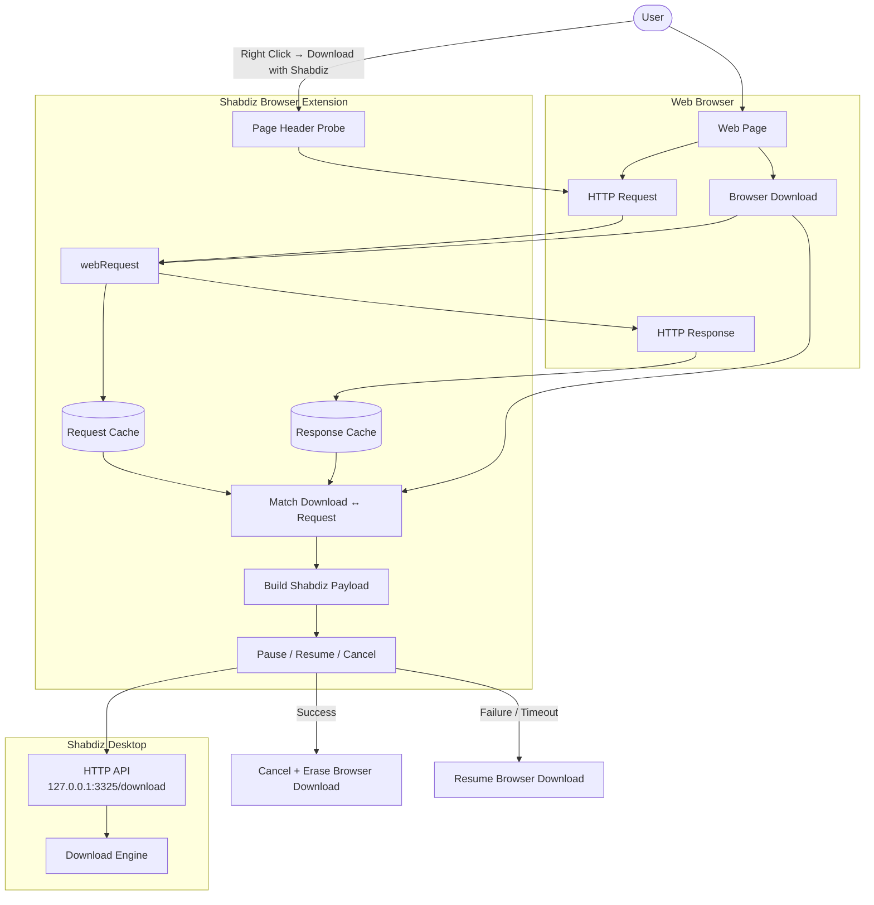

# Shabdiz Download Manager Extension

Browser extension companion for [Shabdiz Download Manager](https://github.com/amiof/shabdiz-download-manager) — a fast, lightweight download manager desktop app.

This extension watches downloads in your browser and forwards them to the Shabdiz app running on your machine.

## How it works

- **Automatic interception** — When enabled, any download started in the browser is cancelled and sent to the Shabdiz app instead.
- **Right-click menu** — Right-click any link or page and choose **"Download with Shabdiz"** to send that URL to the app. Works even when the switch is off.
- **Full request context** — Every forwarded download carries the request headers it was made with (including `Cookie`, `Referer` and `Authorization`) plus the response headers, so the app can fetch the file exactly as the browser would and show the real filename and size.
- **Popup switch** — A popup in the toolbar has an ON/OFF switch. Turning it off means downloads behave normally (handled by the browser); turning it on restores interception. The popup also shows whether the desktop app is reachable.
- **Local only** — The extension only talks to `http://127.0.0.1:3325` where the Shabdiz desktop app listens. Nothing is sent anywhere else.

## How a download flows



## Supported browsers

| Browser             | Support                                                                        |
| ------------------- | ------------------------------------------------------------------------------ |
| Chrome (MV3)        | Full                                                                           |
| Edge (Chromium MV3) | Full                                                                           |
| Firefox (MV3)       | Full                                                                           |
| Safari              | Limited — downloads API isn't fully supported, right-click menu may still work |

## Getting Started

### 1. Install the Shabdiz app

Download and install the [Shabdiz Download Manager desktop app](https://github.com/amiof/shabdiz-download-manager) and make sure it's running (listens on port `3325`).

### 2. Build the extension

```bash
npm install
npm run build            # builds both Chrome and Firefox
```

Or build a single target:

```bash
npm run build:chrome    # Chrome/Edge
npm run build:firefox   # Firefox
```

Production bundles land in `build/chrome-mv3-prod` and `build/firefox-mv3-prod`.

### 3. Load in your browser

**Chrome / Edge**

1. Open `chrome://extensions` (or `edge://extensions`)
2. Enable **Developer mode**
3. Click **Load unpacked** and select `build/chrome-mv3-prod`

**Firefox**

1. Open `about:debugging#/runtime/this-firefox`
2. Click **Load Temporary Add-on**
3. Pick any file inside `build/firefox-mv3-prod` (e.g. `manifest.json`)

### Development

```bash
npm run dev:chrome      # Chrome dev build with hot reload
npm run dev:firefox     # Firefox dev build with hot reload
```

Load the matching dev build (`build/chrome-mv3-dev` or `build/firefox-mv3-dev`) in your browser. Only one dev server runs at a time, so pick a target.

> `build/` is git-ignored and never committed. A folder sitting in `build/` may be much older than `src/`, so **rebuild before you test** — otherwise you are loading old code.

## Project structure

```
src/
├── background.ts             # Service worker entry: wires all chrome.* listeners
├── background/
│   ├── logger.ts             # DEBUG flag + log()
│   ├── urls.ts               # URL helpers, forwardable-scheme check
│   ├── browserApi.ts         # invokeDownloads(): Chrome/Firefox-safe downloads API wrapper
│   ├── requestCache.ts       # webRequest header cache (TTL + prune) and its registration
│   ├── headerProbe.ts        # page-context fetch probe (headers for right-click downloads)
│   ├── contextMenu.ts        # "Download with Shabdiz" menu, pending-download tracking
│   ├── interception.ts       # onCreated flow: pause → send → cancel → erase
│   └── appStatus.ts          # popup ping handler + enabled/disabled change logging
├── popup.tsx                 # Toolbar popup: ON/OFF switch + app reachability indicator
└── lib/
    ├── shabdiz.ts            # Public API barrel (import from here)
    └── shabdiz/
        ├── types.ts          # Constants + payload type contract
        ├── headers.ts        # Header lookup/parsing helpers
        ├── payload.ts        # buildShabdizPayload() — the single payload builder
        └── client.ts         # isShabdizEnabled(), sendToShabdiz()
```

Both code paths — automatic interception and the right-click menu — build their payload
with the same `buildShabdizPayload()` function, so the app always receives the same shape.

## Payload sent to the app

The extension `POST`s JSON to `http://127.0.0.1:3325/download`:

```jsonc
{
  "url": "https://example.com/big.iso", // the download's URL
  "finalUrl": "https://cdn.example.com/big.iso",
  "filename": "big.iso",
  "mimeType": "application/octet-stream",
  "fileSize": 734003200, // from Content-Length, when sent
  "referrer": "https://example.com/page",
  "tabId": 12,
  "frameId": 0,
  "state": "in_progress",

  "source": "auto", // "auto" | "context-menu"
  "explicit": false, // true when the user right-clicked
  "hasCookies": true, // quick check for authenticated links

  "headers": [{ "name": "Cookie", "value": "session=..." }],
  "headersObject": { "Cookie": "session=..." },
  "responseHeaders": [
    {
      "name": "Content-Disposition",
      "value": "attachment; filename=\"big.iso\""
    }
  ],
  "responseHeadersObject": {
    "Content-Disposition": "attachment; filename=\"big.iso\""
  },

  "contentDisposition": "attachment; filename=\"big.iso\"",
  "status": 200,

  "request": {
    "requestId": "1234",
    "method": "GET",
    "requestHeaders": [
      /* ... */
    ]
  },
  "download": {
    /* raw browser DownloadItem */
  },

  // present only when source === "context-menu"
  "pageUrl": "https://example.com/page",
  "linkUrl": "https://example.com/big.iso",
  "srcUrl": null,
  "selectionText": null
}
```

Duplicate header names are possible, so `headers` (the array) is the accurate form and
`headersObject` is the convenience form. Header lookup in the app should be
case-insensitive.

### Test your app without a browser

```bash
curl -X POST http://127.0.0.1:3325/download \
  -H 'Content-Type: application/json' \
  -d '{"url":"https://example.com/big.iso","source":"auto","headers":[],"headersObject":{},"responseHeaders":[],"responseHeadersObject":{}}'
```

## How to use

1. Click the Shabdiz icon in your browser toolbar.
2. Toggle the switch to **ON** — downloads are now sent to the Shabdiz app.
3. Toggle it **OFF** anytime to hand control back to the browser.
4. Right-click any link and pick **"Download with Shabdiz"** for one-off downloads (works even when the switch is off).

## Troubleshooting

- **Downloads aren't being intercepted** — Make sure the Shabdiz app is running and listening on port `3325`. The popup shows a green dot when the app answers and a red one when it doesn't.
- **Right-click sends nothing** — Check that the extension is reloaded after a rebuild; the context menu entry is (re)created on install/update.
- **Headers are empty** — Header capture needs the `webRequest` and `<all_urls>` permissions. If they are missing from the built manifest, `npm run build` was not re-run after editing `package.json`.
- **Sent links don't multiply after a browser restart** — After a successful send the extension cancels the download and erases it from browser history (Chrome only), so Chrome has nothing to restore and re-send on the next start.
- **Chrome shows "Read your browsing history" when installing** — Expected: capturing a download's request headers requires the broad `webRequest` permission. There is no narrower permission that exposes cookies for arbitrary download URLs.
- **Firefox: extension won't install** — Firefox requires a signed extension or Developer Edition with `xpinstall.signatures.required` set to `false` in `about:config`.
- **Firefox: header capture works but no redirect/cookie data** — Firefox hands over all request headers by default and does not accept Chrome's `extraHeaders` option; the extension detects this and falls back automatically.

## License

MIT — see the [main Shabdiz repo](https://github.com/amiof/shabdiz-download-manager) for details.
